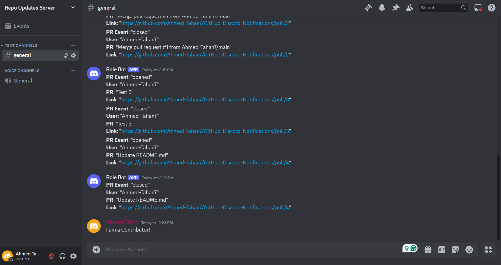

# **GitHub Actions - Discord PR Notifications & Role Assignment**  

## **Overview**  
This project integrates **GitHub Actions** with **Discord** to:  
- Send a message to a Discord channel when a **pull request (PR) is opened or closed**.  
- Assign a **Discord role** to contributors when their PR is merged.  

This helps track contributions and keeps the community updated automatically.  

---

## **How It Works**  
Whenever a **pull request** is created or closed, a notification appears in the **Discord server** like this:  

  

Additionally, when a PR is **merged**, the bot assigns a **role** to the contributor in Discord.  

---

## **Setup Guide**  

### **1. Set Up a Discord Webhook**  
- Go to your **Discord server settings** → **Integrations** → **Webhooks**.  
- Create a webhook and select a **channel** for PR notifications.  
- Copy the webhook URL.  

### **2. Create a Discord Bot**  
- Go to the [Discord Developer Portal](https://discord.com/developers/applications).  
- Create a new bot, enable **Manage Roles** and **Send Messages** permissions.  
- Invite the bot to your server.  
- Make sure the bot’s role is **above** the role it will assign.  

### **3. Add GitHub Secrets**  
Go to your **GitHub repository settings** → **Secrets and variables → Actions**, and add:  
- **Bot Token** (from Discord Developer Portal)  
- **Webhook URL** (for notifications)  
- **Guild (Server) ID**  
- **Role ID** (the role to assign)  

### **4. Map GitHub Users to Discord IDs**  
Since GitHub and Discord usernames are different, create a mapping file (`users.json`) to link them.  

### **5. Enable GitHub Actions**  
The workflow file will trigger automatically when a PR is opened or closed, sending a message to Discord and assigning a role when merged.  

### **6. Test the Setup**  
- Open a **test PR** and check if a **Discord notification appears**.  
- Merge the PR and verify that the **role is assigned**.  
- If something doesn't work, check **GitHub Actions logs** for errors.  

---

## **Troubleshooting**  
- If the **role is not assigned**, ensure the bot has the correct permissions and the **GitHub-Discord username mapping** is correct.  
- If **notifications are not appearing**, check that the **webhook URL is correctly set** in GitHub secrets.  
- If the **GitHub Actions workflow fails**, check the logs for missing secrets or incorrect configurations.  

---

## **Future Improvements**  
- Track other contributions like **issues, commits, and discussions**.  
- Add a **leaderboard for top contributors**.  
- Automate GitHub-Discord user linking instead of using a static mapping file.